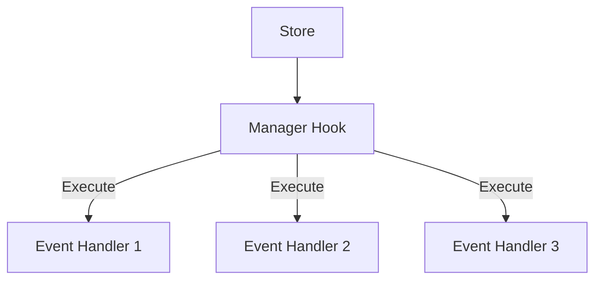

# **1️⃣ 프로젝트 소개** 

이 프로젝트는 웹 기반의 캔버스 드로잉 에디터로, 사용자가 다양한 도형을 생성하고, 선택하고, 이동하고, 크기를 조절하고, 삭제할 수 있는 기능을 제공합니다.

Figma나 Draw.io와 같은 디자인/다이어그램 도구와 유사한 기능을 구현하며, 다중 접속으로 동시 편집이 가능한 기능 제공을 목표로 프로젝트를 시작했습니다.

> ##### 서비스 링크
> [http://www.flowsketch.kr](http://www.flowsketch.kr)

# **2️⃣ 주요기능**

### 캔버스 편집 및 생성

> 캔버스에서 사용자는 다양한 도형을 자유롭게 그리고 편집할 수 있습니다.  
> 도형을 생성하고, 선택하여 이동하거나 크기를 조절할 수 있으며, 필요한 경우 삭제할 수도 있습니다.

- **도형 생성**: 사각형, 타원 등 다양한 도형을 캔버스에 생성
- **요소 선택**: 단일 또는 다중 요소 선택 기능
- **요소 이동**: 선택한 요소를 드래그하여 이동
- **요소 크기 조절**: 선택한 요소의 크기를 핸들을 통해 조절
- **요소 삭제**: 선택한 요소를 키보드 단축키로 삭제
- **캔버스 뷰 조작**: 확대/축소 및 이동 기능

### 동시편집

> ##### 🚀 추후 개발 예정
> 여러 사용자가 동시에 같은 캔버스를 편집할 수 있는 실시간 협업 기능을 제공합니다.  
> 각 사용자의 편집 내용이 즉시 다른 사용자에게 반영됩니다.

- 실시간 커서 및 선택 영역 표시로 다른 사용자의 작업 상태를 확인 가능
- 충돌 방지를 위한 작업 단위별 락(Lock) 메커니즘 구현
- 변경 사항에 대한 실시간 동기화 및 영구 저장

# **3️⃣ 아키텍처 개요**

## **✅** 단어 정리

### 1. `elementRegistry`

`elementRegistry`는 캔버스의 모든 요소들을 관리하는 중앙 저장소 역할을 하며, 다음과 같은 두 가지 핵심 데이터 구조를 포함한다.

```tsx
export interface ElementRegistry {
  elements: {
    [id: string]: EllipseSketchElement | RectSketchElement;
  };
  layerOrder: string[];
}
```

- **elements**:
  - 각 요소의 ID를 키로 하고, 해당 요소의 인스턴스를 값으로 가지는 객체.
  - 각 요소는 위치, 크기, 회전 등의 속성을 포함.
- **layerOrder**:
  - 요소들의 ID를 배열로 저장하여 렌더링 순서(z-index)를 관리

### 2. `Store`

`store`는 캔버스의 상태와 데이터를 관리하는 중앙 저장소이다.

`store` 는 각각의 Manager Hook 들과 긴밀하게 연계되어 동작하며, Manager Hook들은 store의 특정 부분을 담당하여 관리하는 역할을 한다.

### 3. `Manager (Hook)`

Manager Hook은 React 커스텀 훅으로, 캔버스의 각 기능을 독립적으로 관리한다.

Manager 에서는 store 를 관리하는 Hook 으로 분리되며, 각각의 Manager Hook은 store 내에서 특정 기능(예: 선택, 이동, 크기 조절 등)에 대한 상태와 로직을 개별로 관리하고 필요한 기능을 제공.



예를들면 아래와 같이 설명할 수 있다.

- **useCanvasElementRegistry**: 요소들의 생성, 수정, 삭제와 관련된 store 상태를 관리
- **useCanvasSelectManager**: 요소 선택 상태와 관련된 store 부분을 관리
- **useCanvasMoveElementManager**: 요소 이동과 관련된 상태를 store에서 관리

## **✅ 핵심 컴포넌트**

### **Canvas 컴포넌트**

> Canvas 컴포넌트는 모든 드로잉 기능이 구현되는 메인 컴포넌트입니다.  
> 다양한 훅을 통합하여 사용자 인터랙션을 이 곳에서 처리합니다.
> `useCanvasActionHandler` 를 통해 다양한 액션 핸들러를 통합하고, `usePaintingCanvas` 를 통해 캔버스에 요소를 렌더링합니다.

```tsx
export const Canvas = () => {
  const { canvasRef } = useCanvas();
  const { viewState, viewAction } = useCanvasViewManager();
  const { elementRegistry, elementRegistryAction } = useCanvasElementRegistry();
  const { selectState, selectAction } = useCanvasSelectManager(elementRegistry, viewState);
  const { createState, createAction } = useCanvasCreateElementManger(viewState, elementRegistryAction);
  const { deleteAction } = useCanvasDeleteElementManager(selectState, selectAction, elementRegistryAction);
  const { moveAction } = useCanvasMoveElementManager(viewState, selectState, elementRegistryAction);
  const { resizeAction } = useCanvasResizeElementManager(viewState, selectState, elementRegistryAction);

  const handler = useCanvasActionHandler(selectState, viewAction, selectAction, createAction, deleteAction, moveAction, resizeAction);
  usePaintingCanvas(canvasRef, elementRegistry, viewState, selectState, createState);

  // 렌더링 로직...
};
```

## **✅ 주요 모델**

### 1. `BaseSketchElement`

> 모든 캔버스 요소의 기본 클래스입니다.  
> 위치, 크기, 회전 등의 공통 속성과 메소드를 제공하며, resize 메소드를 통해 요소 크기 조절 기능을 구현합니다.

```tsx
export abstract class BaseSketchElement {
  /**
   * 요소의 크기와 위치를 조정하는 메소드
   *
   * @param dx - X축 방향으로의 마우스 이동량
   * @param dy - Y축 방향으로의 마우스 이동량
   * @param directions - 리사이즈가 시작된 방향들 (top, right, bottom, left)
   */
  resize(dx: number, dy: number, directions: ('top' | 'right' | 'bottom' | 'left')[]) {
    const adjustedDeltaX = directions.includes('left') ? -dx : directions.includes('right') ? dx : 0;
    const adjustedDeltaY = directions.includes('top') ? -dy : directions.includes('bottom') ? dy : 0;
    const deltaX = !directions.includes('left') && !directions.includes('right') ? 0 : dx;
    const deltaY = !directions.includes('top') && !directions.includes('bottom') ? 0 : dy;

    const newWidth = Math.max(this.width + adjustedDeltaX, 10);
    const newHeight = Math.max(this.height + adjustedDeltaY, 10);
    const newX = this.x + deltaX / 2;
    const newY = this.y + deltaY / 2;

    this.x = newX;
    this.y = newY;
    this.width = newWidth;
    this.height = newHeight;
  }
}
```

### 2. `CanvasBoard`

> `CanvasBoard`는 캔버스의 메타데이터와 상태를 관리하는 모듈입니다:

```typescript
interface CanvasBoardState {
  canvasList: CanvasMetadata[];
}

interface CanvasMetadata {
  id: string;
  name: string;
  description: string;
  createdAt: string;
  updatedAt: string;
  createdBy: string;
  lastModifiedBy: string;
  isPublic: boolean;
  version: number;
}
```

## **✅ 좌표계 시스템**

프로젝트는 두 가지 좌표계가 적용되어있다.

- **뷰 좌표계**: 화면에 보이는 좌표 (마우스 이벤트에서 얻는 좌표)
- **절대 좌표계**: 실제 요소의 위치와 크기를 나타내는 좌표

좌표계 변환 예시:

```tsx
// 뷰 좌표계 → 절대 좌표계 변환
const convertWidth = Math.abs(endPoint.x - startPoint.x) / viewState.scale;
const convertHeight = Math.abs(endPoint.y - startPoint.y) / viewState.scale;
const convertOffsetX = (Math.abs(viewState.offset.x) + Math.min(startPoint.x, endPoint.x)) / viewState.scale;
const convertOffsetY = (Math.abs(viewState.offset.y) + Math.min(startPoint.y, endPoint.y)) / viewState.scale;
```

# 4️⃣ 일정 관리 및 개선방향

## Github 프로젝트 관리

[flow-sketch • IceBear9028](https://github.com/users/IceBear9028/projects/1)

## **최근 추가된 기능**

- [x] **캔버스 메타데이터 관리**: 이름 변경, 메모 추가 기능 구현
- [x] **사용자 중심 URL 구조**: URL 체계를 사용자 중심으로 재구성
- [x] **로컬 스토리지 동기화**: 캔버스 데이터 자동 저장 구현
- [x] **캔버스 목록 관리**: 시간순 정렬 및 필터링 기능 추가

## **다음 개선 계획**

[기존 개선 방향에 추가:]

- [ ] **캔버스 공유 기능**: 다른 사용자와 캔버스 공유 기능 구현
- [ ] **실시간 협업**: 여러 사용자의 동시 편집 기능 구현
- [ ] **히스토리 관리**: 캔버스 변경 이력 관리 기능 추가
