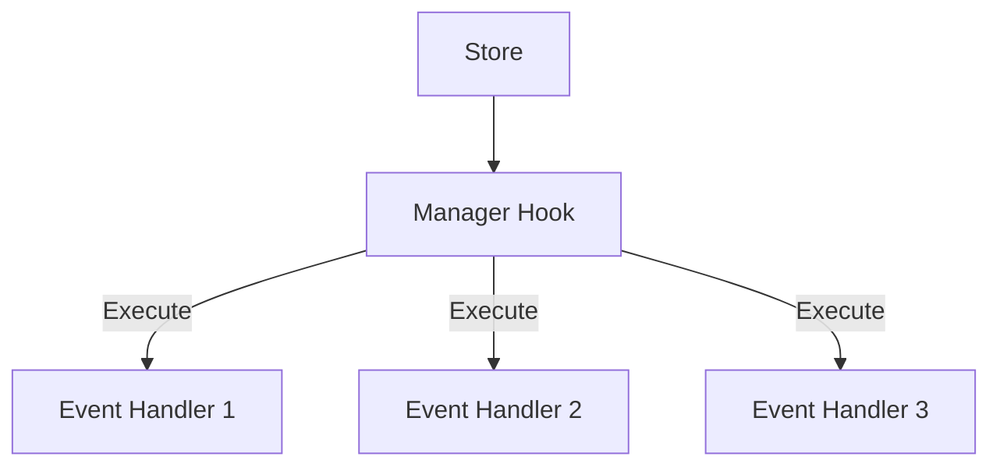

# **1️⃣ 프로젝트 소개**

이 프로젝트는 웹 기반의 캔버스 드로잉 에디터로, 사용자가 다양한 도형을 생성하고, 선택하고, 이동하고, 크기를 조절하고, 삭제할 수 있는 기능을 제공합니다.

Figma나 Draw.io와 같은 디자인/다이어그램 도구와 유사한 기능을 구현하며, 다중 접속으로 동시 편집이 가능한 기능 제공을 목표로 프로젝트를 시작했습니다.

# **2️⃣ 주요기능**

### 캔버스 편집 및 생성

> 캔버스에서 사용자는 다양한 도형을 자유롭게 그리고 편집할 수 있습니다.   
> 도형을 생성하고, 선택하여 이동하거나 크기를 조절할 수 있으며, 필요한 경우 삭제할 수도 있습니다.

- **도형 생성**: 사각형, 타원 등 다양한 도형을 캔버스에 생성
- **요소 선택**: 단일 또는 다중 요소 선택 기능
- **요소 이동**: 선택한 요소를 드래그하여 이동
- **요소 크기 조절**: 선택한 요소의 크기를 핸들을 통해 조절
- **요소 삭제**: 선택한 요소를 키보드 단축키로 삭제
- **캔버스 뷰 조작**: 확대/축소 및 이동 기능

### 동시편집

> 여러 사용자가 동시에 같은 캔버스를 편집할 수 있는 실시간 협업 기능을 제공합니다.   
> 각 사용자의 편집 내용이 즉시 다른 사용자에게 반영됩니다.

- 실시간 커서 및 선택 영역 표시로 다른 사용자의 작업 상태를 확인 가능
- 충돌 방지를 위한 작업 단위별 락(Lock) 메커니즘 구현
- 변경 사항에 대한 실시간 동기화 및 영구 저장

# **3️⃣ 아키텍처 개요**

## **✅** 단어 정리

### `elementRegistry`

`elementRegistry`는 캔버스의 모든 요소들을 관리하는 중앙 저장소 역할을 하며, 다음과 같은 두 가지 핵심 데이터 구조를 포함한다.

```tsx
export interface ElementRegistry {
  elements: {
    [id: string]: EllipseSketchElement | RectSketchElement;
  };
  layerOrder: string[];
}
```

- **elements**:
    - 각 요소의 ID를 키로 하고, 해당 요소의 인스턴스를 값으로 가지는 객체.
    - 각 요소는 위치, 크기, 회전 등의 속성을 포함.
- **layerOrder**:
    - 요소들의 ID를 배열로 저장하여 렌더링 순서(z-index)를 관리

### `Store`

`store`는 캔버스의 상태와 데이터를 관리하는 중앙 저장소이다.

`store` 는 각각의 Manager Hook 들과 긴밀하게 연계되어 동작하며, Manager Hook들은 store의 특정 부분을 담당하여 관리하는 역할을 한다.

### `Manager (Hook)`

Manager Hook은 React 커스텀 훅으로, 캔버스의 각 기능을 독립적으로 관리한다.

Manager 에서는 store 를 관리하는 Hook 으로 분리되며, 각각의 Manager Hook은 store 내에서 특정 기능(예: 선택, 이동, 크기 조절 등)에 대한 상태와 로직을 개별로 관리하고 필요한 기능을 제공.



예를들면 아래와 같이 설명할 수 있다.

- **useCanvasElementRegistry**: 요소들의 생성, 수정, 삭제와 관련된 store 상태를 관리
- **useCanvasSelectManager**: 요소 선택 상태와 관련된 store 부분을 관리
- **useCanvasMoveElementManager**: 요소 이동과 관련된 상태를 store에서 관리

## **✅ 핵심 컴포넌트**

### **Canvas 컴포넌트**

> Canvas 컴포넌트는 모든 드로잉 기능이 구현되는 메인 컴포넌트입니다.   
> 다양한 훅을 통합하여 사용자 인터랙션을 이 곳에서 처리합니다. 
> `useCanvasActionHandler` 를 통해 다양한 액션 핸들러를 통합하고, `usePaintingCanvas` 를 통해 캔버스에 요소를 렌더링합니다.

```tsx
export const Canvas = () => {
  const { canvasRef } = useCanvas();
  const { viewState, viewAction } = useCanvasViewManager();
  const { elementRegistry, elementRegistryAction } = useCanvasElementRegistry();
  const { selectState, selectAction } = useCanvasSelectManager(elementRegistry, viewState);
  const { createState, createAction } = useCanvasCreateElementManger(viewState, elementRegistryAction);
  const { deleteAction } = useCanvasDeleteElementManager(selectState, selectAction, elementRegistryAction);
  const { moveAction } = useCanvasMoveElementManager(viewState, selectState, elementRegistryAction);
  const { resizeAction } = useCanvasResizeElementManager(viewState, selectState, elementRegistryAction);

  const handler = useCanvasActionHandler(selectState, viewAction, selectAction, createAction, deleteAction, moveAction, resizeAction);
  usePaintingCanvas(canvasRef, elementRegistry, viewState, selectState, createState);
  
  // 렌더링 로직...
}
```

## **✅ 주요 훅(Hook)과 기능**

### **useCanvasElementRegistry**

> `ElementRegistry` 의 역할에 대한 자세한 글은 여기를 확인
>
>
> [elementRegistry](https://www.notion.so/elementRegistry-1b20c7afbf0e8025a8a2f8f34ed52b3d?pvs=21)
>

**설명**

- `ElementRegistry` 를 관리하고 요소에 대한 CRUD 작업을 처리하는 훅.
- 이 훅은 요소 생성, 이동, 크기 조절, 삭제 등의 액션을 제공.

```tsx
  export function useCanvasElementRegistry(): {
    elementRegistry: ElementRegistry;
    elementRegistryAction: ElementRegistryAction;
  } {
    const [elementRegistry, setElementRegistry] = useState<ElementRegistry>({
      elements: { /* 초기 요소들 */ },
      layerOrder: ['a-3', 'a-1', 'a-2', 'a-4', 'a-5'],
    });
    
    function createElement<T extends BaseSketchElementType>(type: T, params: SketchElementParams<T>) {
      // 요소 생성 로직
    }
    
    function deleteElement(id: string) {
      // 요소 삭제 로직
    }
    
    // 다른 액션 함수들...
    
    return { elementRegistry, elementRegistryAction: { /* 액션 함수들 */ } };
  }
```

### **useCanvasCreateElementManger**

**설명**

- 새로운 도형을 생성하는 기능을 관리하는 훅
- 이 훅은 마우스 드래그를 통해 도형의 크기와 위치를 결정하고, 드래그가 완료되면 요소를 생성

```tsx
export function useCanvasCreateElementManger(
  viewState: ViewManagerState,
  elementRegistryAction: ElementRegistryAction,
): {
  createState: CreateElementManagerState;
  createAction: CreateElementMangerAction;
} {
  const [isDrawing, setIsDrawing] = useState<boolean>(false);
  // 다른 상태들...
  
  // 마우스 업 이벤트 핸들러 - 요소 생성 완료
  const handleMouseUp = () => {
    if (!isDrawing || !startPoint || !endPoint || !shapeType) return;

		// 좌표계 변환 및 길이 계산...

		// 좌표계 변환 및 요소 생성 로직
    elementRegistryAction.createElement(shapeType, {
      id: uuidv4(),
      width: convertWidth,
      height: convertHeight,
      x: convertOffsetX + convertWidth / 2,
      y: convertOffsetY + convertHeight / 2,
    });

    // 상태 초기화
    ...
  };
}
```

### **useCanvasSelectManager**

**설명**

- 캔버스에서 요소들을 선택 및 관리하는 훅
- 이 훅은 **드래그를 통한 선택 영역 생성**, **선택된 요소 관리**, **바운딩 박스 계산** 등의 기능을 제공

```tsx
export function useCanvasSelectManager(
  registry: ElementRegistry,
  viewState: ViewManagerState,
): {
  selectState: SelectManagerState;
  selectAction: SelectManagerAction;
} {
  const [isSelecting, setSelectable] = useState<boolean>(false);
  
  // 마우스 드래그 시, 드래그박스 안에 도형이 포함되어있는지 탐지하는 로직
  useEffect(() => {
    if (!startPoint || !endPoint) return;

		// 드래그 박스를 그려서 절대좌표계로 변환
    const dragRect = {...};

    // 각 요소를 드래그 영역과 충돌하는지 하나씩 확인
    for (const elementId of registry.layerOrder) {
      const element = registry.elements[elementId];
      
      // 드래그박스와 요소가 서로 충돌하는지 확인
      const isObb = isOBBColliding(dragRect, element);

      if (isObb) {
        element.enableEditing();
        newSelectElement[element.id] = new BaseSelectBox({
          // 선택된 요소 정보
        });
      } else {
        element.disableEditing();
      }
    }
    setSelectElement(newSelectElement);
  }, [startPoint, endPoint]);
}
```

### **useCanvasMoveElementManager**

**설명**

- 선택된 요소의 이동 기능을 관리하는 훅
- 이 훅은 선택된 요소 내부의 바운딩 박스 내부를 드래그 했을 때, 선택된 요소를 이동하는 기능을 제공

```tsx
export function useCanvasMoveElementManager(
  viewState: ViewManagerState,
  selectState: SelectManagerState,
  elementRegistryAction: ElementRegistryAction,
): {
  moveAction: MoveManagerAction;
} {
  const [alignmentPoint, setAlignmentPoint] = useState<{ x: number; y: number } | null>(null);
  const [isDrawing, setDrawing] = useState<boolean>(false);

  const handleMouseMove = (event: MouseEvent<HTMLCanvasElement>) => {
    // ...길이 및 위치를 절대 좌표계로 변환
    // 선택된 요소를 같은 크기로 이동시킴
    for (const selectKey of Object.keys(selectState.selectElement)) {
      elementRegistryAction.moveElement(selectKey, { moveX: deltaX, moveY: deltaY });
    }
    setAlignmentPoint({ x: currentX, y: currentY });
  };
}
```

### **useCanvasResizeElementManager**

**설명**

- 선택된 요소의 크기 조절 기능을 관리하는 훅
- 이 훅은 바운딩 박스의 핸들을 드래그하여 **요소의 크기를 조절**하는 기능을 제공

```tsx
export function useCanvasResizeElementManager(
  viewState: ViewManagerState,
  selectState: SelectManagerState,
  elementRegistryAction: ElementRegistryAction,
): {
  resizeAction: ResizeManagerAction;
} {
  const [startPoint, setStartPoint] = useState<{ x: number; y: number } | null>(null);
  const [isResizing, setIsResizing] = useState<boolean>(false);
  const [activeHandle, setActiveHandle] = useState<ResizeHandlePosition>(null);
  const [initialBoundingBox, setInitialBoundingBox] = useState<{
    cx: number;
    cy: number;
    width: number;
    height: number;
  } | null>(null);

  const handleMouseMove = (event: MouseEvent<HTMLCanvasElement>) => {
    if (!event || !isResizing || !startPoint || !initialBoundingBox || !activeHandle) return;

    const currentX = event.nativeEvent.offsetX;
    const currentY = event.nativeEvent.offsetY;

    // 마우스 이동 거리 계산 (스케일 고려)
    const deltaX = (currentX - startPoint.x) / viewState.scale;
    const deltaY = (currentY - startPoint.y) / viewState.scale;

    // 선택된 모든 요소에 대해 크기 조절 적용
    for (const selectKey of Object.keys(selectState.selectElement)) {
      elementRegistryAction.resizeElement(selectKey, {
        resizeX: deltaX,
        resizeY: deltaY,
        pointDirection: activeHandle.split('-') as ('top' | 'right' | 'bottom' | 'left')[],
      });
    }

    setStartPoint({ x: currentX, y: currentY });
  };
}
```

### **usePaintingCanvas**

**설명**

- Canvas 에 직접적으로 그림을 그리는 Hook
- 다른 `Manager` Hook 및 `elementRegistry` 정보를 받아서 캔버스에 반영하는 Hook
- 그렇기에 모든 `Manager` 에 대한 상태들을 `props` 로 받아서 실행됨

```tsx
export function usePaintingCanvas(
  canvasRef: React.RefObject<HTMLCanvasElement | null>,
  registry: ElementRegistry,
  viewState: ViewManagerState,
  selectState: SelectManagerState,
  createState: CreateElementManagerState,
) {
  useEffect(() => {
    const { elements, layerOrder } = registry;
    
    // 선택된 요소가 여러 개일 때 바운딩 박스와 리사이즈 핸들 그리기
    if (Object.keys(selectState.selectElement).length > 1) {
      const { cx, cy, width, height } = selectState.boundingBox;

      ctx.save();
      const resizeAnchorWidth = 8;
      const resizeAnchorRadius = 2;
      const resizeAnchorPosition = [
        { x: cx - width / 2, y: cy - height / 2 }, // 왼쪽 상단
        { x: cx - width / 2, y: cy + height / 2 }, // 왼쪽 하단
        { x: cx + width / 2, y: cy - height / 2 }, // 오른쪽 상단
        { x: cx + width / 2, y: cy + height / 2 }, // 오른쪽 하단
      ];

      // 바운딩 박스 그리기
      ctx.lineWidth = 2;
      ctx.strokeStyle = colorToken['focusColor'];
      ctx.fillStyle = 'transparent';
      ctx.beginPath();
      ctx.rect(cx - width / 2, cy - height / 2, width, height);
      ctx.fill();
      ctx.stroke();
      ctx.closePath();

      // 리사이즈 핸들 그리기
      for (const anchorPosition of resizeAnchorPosition) {
        const { x, y } = anchorPosition;
        ctx.lineWidth = 3;
        ctx.strokeStyle = colorToken['focusColor'];
        ctx.fillStyle = colorToken['white'];
        ctx.beginPath();
        ctx.roundRect(x - resizeAnchorWidth / 2, y - resizeAnchorWidth / 2, resizeAnchorWidth, resizeAnchorWidth, resizeAnchorRadius);
        ctx.stroke();
        ctx.fill();
      }
      ctx.restore();
    }
  });
}
```

### useCanvasActionHandler

**설명**

- Canvas 의 이벤트들을 관리하는 Hook
- `Manager` Hook 의 action 들을 받아서 조건부별로 action 로직들을 실행시키는 메인 Hook

```tsx
export function useCanvasActionHandler(
  selectState: SelectManagerState,
  viewAction: ViewManagerAction,
  selectAction: SelectManagerAction,
  createAction: CreateElementMangerAction,
  deleteAction: DeleteManagerAction,
  moveAction: MoveManagerAction,
  resizeAction: ResizeManagerAction,
) {
  const shapeType = useCanvasRemoteStore((store) => store.shapeType);
  const remoteMode = useCanvasRemoteStore((store) => store.mode);
  const [editMode, setEditMode] = useState<'select' | 'resize' | 'move'>('select');

  const handleWheel = (() => {
    if (remoteMode === 'view') return viewAction.handleWheel;
  })();

  const handleMouseDown = (event: React.MouseEvent<HTMLCanvasElement>) => {
    if (remoteMode === 'view') return viewAction.handleMouseDown(event);
    if (remoteMode === 'edit') {
      // ...여기에 특정조건의 핸들러를 실행시킴
    }
  };

  const handleMouseUp = () => {
    if (remoteMode === 'view') return viewAction.handleMouseUp();
    if (remoteMode === 'edit') {
	    // ...여기에 특정조건의 핸들러를 실행시킴
    }
  };

  const handleMouseMove = (event: React.MouseEvent<HTMLCanvasElement>) => {
    // 마우스 우클릭하고 있는 동안에만 핸들러 실행
    if (event.buttons !== 1) return;
      
    if (remoteMode === 'view') return viewAction.handleMouseMove(event);
    if (remoteMode === 'edit') {
			// ...여기에 특정조건의 핸들러를 실행시킴
    }
  };

  const handleKeyDown = () => {
    if (remoteMode === 'edit') {
      return deleteAction.handleKeyDown;
    }
  };

  return {
    handleWheel,
    handleMouseDown,
    handleMouseUp,
    handleMouseMove,
    handleKeyDown,
  };
}
```

## **✅ 주요 모델**

### **`BaseSketchElement`**

> 모든 캔버스 요소의 기본 클래스입니다.  
> 위치, 크기, 회전 등의 공통 속성과 메소드를 제공하며, resize 메소드를 통해 요소 크기 조절 기능을 구현합니다.

```tsx
export abstract class BaseSketchElement {
  /**
   * 요소의 크기와 위치를 조정하는 메소드
   *
   * @param dx - X축 방향으로의 마우스 이동량
   * @param dy - Y축 방향으로의 마우스 이동량
   * @param directions - 리사이즈가 시작된 방향들 (top, right, bottom, left)
   */
  resize(dx: number, dy: number, directions: ('top' | 'right' | 'bottom' | 'left')[]) {
    const adjustedDeltaX = directions.includes('left') ? -dx : directions.includes('right') ? dx : 0;
    const adjustedDeltaY = directions.includes('top') ? -dy : directions.includes('bottom') ? dy : 0;
    const deltaX = !directions.includes('left') && !directions.includes('right') ? 0 : dx;
    const deltaY = !directions.includes('top') && !directions.includes('bottom') ? 0 : dy;

    const newWidth = Math.max(this.width + adjustedDeltaX, 10);
    const newHeight = Math.max(this.height + adjustedDeltaY, 10);
    const newX = this.x + deltaX / 2;
    const newY = this.y + deltaY / 2;

    this.x = newX;
    this.y = newY;
    this.width = newWidth;
    this.height = newHeight;
  }
}
```

## **✅ 좌표계 시스템**

프로젝트는 두 가지 좌표계가 적용되어있다.

- **뷰 좌표계**: 화면에 보이는 좌표 (마우스 이벤트에서 얻는 좌표)
- **절대 좌표계**: 실제 요소의 위치와 크기를 나타내는 좌표

좌표계 변환 예시:

```tsx
// 뷰 좌표계 → 절대 좌표계 변환
const convertWidth = Math.abs(endPoint.x - startPoint.x) / viewState.scale;
const convertHeight = Math.abs(endPoint.y - startPoint.y) / viewState.scale;
const convertOffsetX = (Math.abs(viewState.offset.x) + Math.min(startPoint.x, endPoint.x)) / viewState.scale;
const convertOffsetY = (Math.abs(viewState.offset.y) + Math.min(startPoint.y, endPoint.y)) / viewState.scale;
```

# 4️⃣ 일정 관리 및 개선방향

## Github 프로젝트 관리

[flow-sketch • IceBear9028](https://github.com/users/IceBear9028/projects/1)

## **향후 개선 방향**

- [ ]  **회전 기능 추가**: 요소 회전 기능 구현
- [ ]  **비율 유지 리사이징**: Shift 키를 누른 상태에서 비율을 유지하며 리사이징하는 기능
- [ ]  **스냅 기능**: 그리드나 다른 요소에 스냅되는 기능
- [ ]  **상태 관리 개선**: 현재 훅 기반 상태 관리를 외부 상태 관리 라이브러리로 마이그레이션
- [ ]  **성능 최적화**: 대량의 요소를 처리할 때의 성능 개선
- [ ]  **다양한 도형 추가**: 더 많은 종류의 도형 및 커스텀 도형 지원
- [ ]  **레이어 시스템 개선**: 요소의 z-index 관리 및 레이어 UI 구현
