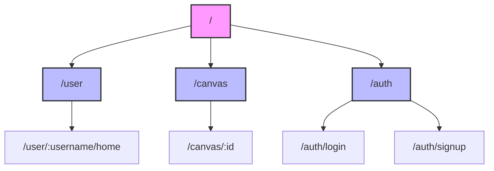
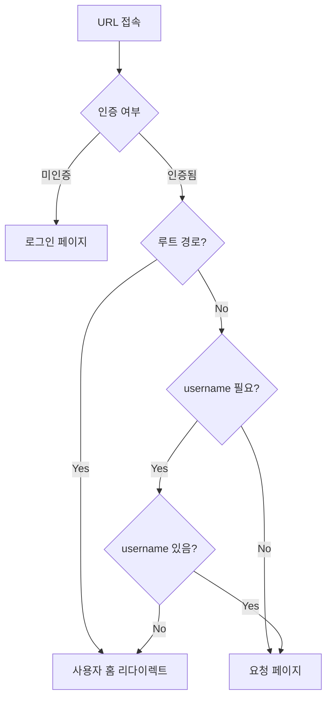

# URL Documentation

## Overview
> 프로젝트의 URL 구조는 크게 세 가지 도메인으로 구분
> - User 도메인 (`/user`)
> - Canvas 도메인 (`/canvas`)
> - Auth 도메인 (`/auth`)

## URL 접근 예시

```typescript
// 루트 접근
/     -> /user/local-user/home  (자동 리다이렉트)

// 사용자 페이지 접근
/user                    -> /user/local-user/home  (자동 리다이렉트)
/user/username/home      -> /user/username/home    (직접 접근)

// 캔버스 접근
/canvas        -> 404 NotFound    (잘못된 접근)
/canvas/abc123 -> /canvas/abc123  (특정 캔버스)

// 인증
/auth/login    -> 로그인 페이지
/auth/signup   -> 회원가입 페이지
```

## URL 패턴

### 도메인 이름
#### `User`
- `/user`: 사용자 도메인 루트 경로
- `/user/:username/home`: 특정 사용자의 대시보드
    - `:username` - 사용자 식별자

#### `Canvas`
- `/canvas`: 캔버스 루트 경로
- `/canvas/:id`: 특정 캔버스 편집/조회 페이지
    - `:id` - 캔버스 식별자

#### `Auth`
- `/auth/login`: 로그인 페이지
- `/auth/signup`: 회원가입 페이지

### Domain 구조 표


## 페이지 접근 로직



### 접근 제어 로직
1. 모든 비인증 사용자는 `/auth/*` 경로로 리다이렉트
2. 루트 경로('/') 접근 시 자동으로 사용자 홈으로 리다이렉트
3. username이 필요한 경로(`/user`)에 접근 시:
    - username 없으면 기본값으로 리다이렉트
    - username 있으면 직접 접근
4. 캔버스 접근 시 유효한 id 필요
