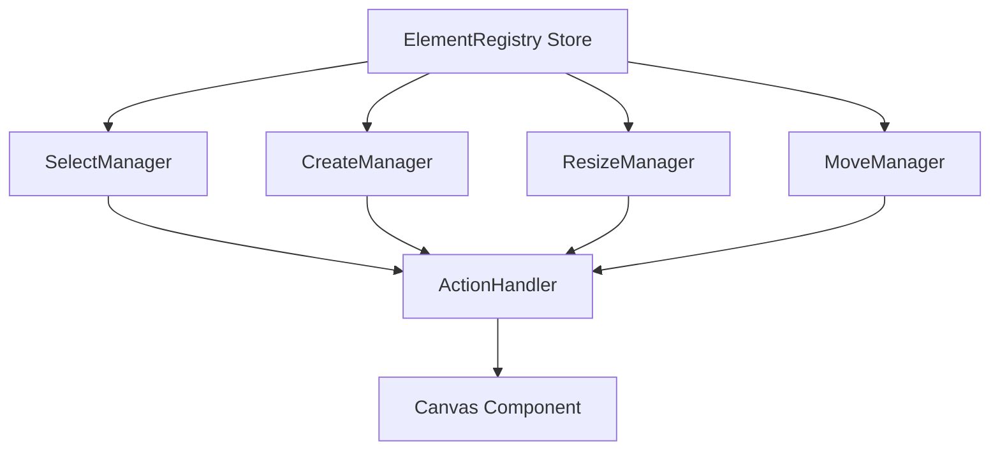

# Canvas Element Hooks

## Overview
> 캔버스 요소들의 상태 관리와 조작을 담당합니다.

## 상태 관리 구조




## 주요 Hook

### 1. `useCanvasElementRegistry`
> 캔버스 요소들의 중앙 저장소 역할을 하는 Hook 

```typescript
export function useCanvasElementRegistry(): {
  elementRegistry: ElementRegistry;
  elementRegistryAction: ElementRegistryAction;
}
```

- **주요 기능**:
    - 캔버스 요소 생성, 수정, 삭제 관리
    - `localStorage` 와 상태 동기화
    - 요소(Element)의 레이어 순서 관리
    - JSON 데이터를 요소인스턴스로 복원

### 2. `useCanvasActionHandler`
> 캔버스의 모든 이벤트 핸들러를 관리하는 중앙 Hook

- **처리하는 이벤트**:
    - `handleMouseDown`: 마우스 클릭 시작
    - `handleMouseMove`: 마우스 이동
    - `handleMouseUp`: 마우스 클릭 종료
    - `handleWheel`: 확대/축소
    - `handleKeyDown`: 키보드 입력

### 3. `useCanvasSelectElementManager`
> 캔버스 내에서 마우스 드래그 시, 요소 선택 기능을 관리하는 Hook

- **주요 기능**:
    - 드래그 박스를 통한 요소 선택
    - 다중 선택 지원
    - 선택된 요소의 바운딩 박스 계산
    - 선택 상태 초기화

### 4. `useCanvasCreateElementManager`
> 새로운 요소를 생성하는데 관리하는 Hook

- **주요 기능**:
    - 드래그를 통한 도형 크기 지정
    - 도형 타입별 생성 로직
    - 좌표계 변환 처리

### 5. `useCanvasResizeElementManager`
> 선택된 요소의 크기 조절을 관리하는 Hook

- **주요 기능**:
    - 리사이즈 핸들 관리
    - 다중 요소 동시 리사이즈
    - 비율 유지 리사이즈

### 6. `usePaintingCanvas`
> 캔버스를 표현하는 JSON 데이터를 실제 캔버스에 랜더링 시키는 Hook

- **주요 기능**:
    - 요소 렌더링
    - 선택 영역 표시
    - 리사이즈 핸들 표시
    - 뷰포트 관리
