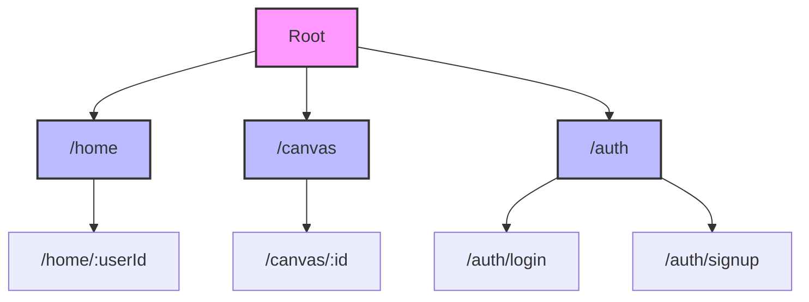
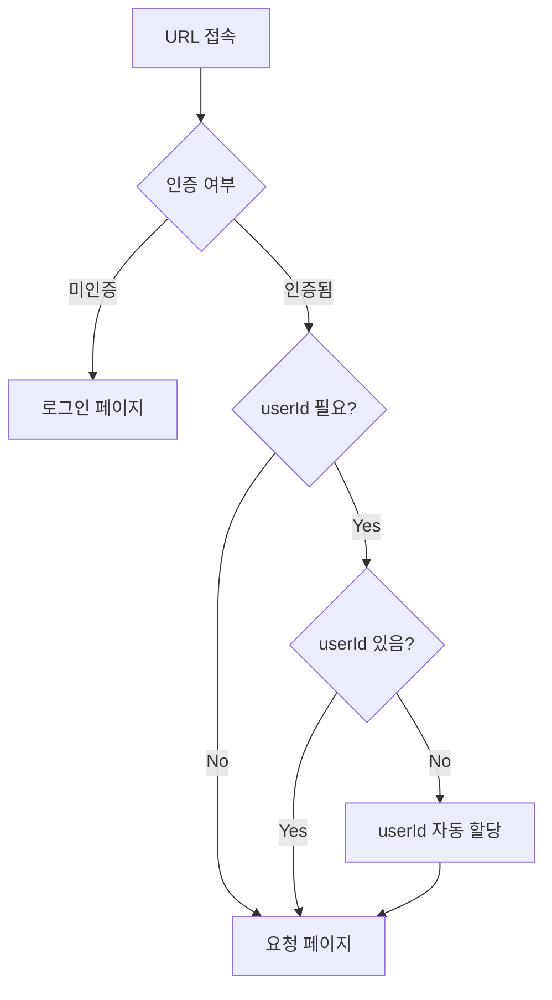

# URL Documentation

## Overview
프로젝트의 URL 구조는 크게 세 가지 도메인으로 구분됩니다:
- HomePage 도메인 (`/home`)
- Canvas 도메인 (`/canvas`)
- Auth 도메인 (`/auth`)

## URL 접근 예시

```typescript
// 홈 접근
/home          -> /home/testUser  (자동로그인 on 이면 userId 자동할당)
/home/user123  -> /home/user123   (직접 접근)

// 캔버스 접근
/canvas        -> 404 NotFound    (잘못된 접근)
/canvas/abc123 -> /canvas/abc123  (특정 캔버스)

// 인증
/auth/login    -> 로그인 페이지
/auth/signup   -> 회원가입 페이지
```

## URL 패턴

### 도메인 이름
#### `HomePage`
- `/home`: 홈 루트 경로
- `/home/:userId`: 특정 사용자의 홈 페이지
    - `:userId` - 사용자 식별자

#### `Canvas`
- `/canvas`: 캔버스 루트 경로
- `/canvas/:id`: 특정 캔버스 편집/조회 페이지
    - `:id` - 캔버스 식별자

#### `Auth`
- `/auth/login`: 로그인 페이지
- `/auth/signup`: 회원가입 페이지

### Domin 구조  표



## 페이지 접근 로직



### 접근 제어 로직
1. 모든 비인증 사용자는 `/auth/*` 경로로 리다이렉트
2. userId가 필요한 경로(`/home`)에 접근 시:
    - userId 없으면 자동 할당 후 리다이렉트
    - userId 있으면 직접 접근
3. 캔버스 접근 시 유효한 id 필요
